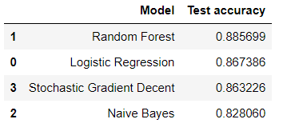

# Sentiment Analysis of Online Product Reviews (v 1.0)

This is a repository to analyze Sentiments from Amazon reviews using 4 different state-of-the-art supervised models. The classifiers are as following:
- Naive Bayes
- Random Forest
- Logistic Regression
- Stochastic Gradient Descent (SGD)

The sentiments are multiclass labels, containing Postitive, Negative and Neutral classes.

## Table of Contents

1. [Manifest](#manifest)
2. [Dataset](#dataset)
3. [How to run](#how-to-run)
4. [Preprocessing steps](#preprocessing-steps)
5. [Visualizing labels](#visualizing-labels)
6. [Results](#results)
7. [Contact](#contact)
8. [Future work](#future-work)
9. [Acknowledgements](#acknowledgements)
10. [License](#license)
11. [Project status](#project-status)

## Manifest

```
- Sentiment Analysis.ipynb --> A Jupyter notebook that contains all the code
- README.md ----> This markdown file
- .gitignore ----------> A default gitignore file
- .ipynb_checkpoints -----> Jupyter notebook checkpoints
- images -------> Contains all the images for Readme file
```

## How to run
- Clone the repository using `gh repo clone rafin007/rm-sentiment-analysis`
- Open using Jupyter Notebook
- Install the necessary dependencies using `!pip install (library name)`
- Change the dataset directory accordingly
- Run each cell chronologically

## Dataset
The dataset of Amazon Reviews can be downloaded from [here](https://drive.google.com/drive/folders/1KJYbFFEW21wWWvlikXl7KOqWwaq8Gdhd?usp=sharing) (286 MB)


## Preprocessing Steps
The list of preprocessing steps:

- Labeling the dataset as Positive, Negative or Neutral
- Removing special characters, punctuation, numbers
- Tokenization
- Stemming
- Removing stopwords

## Visualizing Labels


## Results
The final testing accuracy for all the four different classifiers:



## Contact
If there are any issues or questions regarding this project, please reach out to me at arefinm@lakeheadu.ca

## Future work
- Broaden the base and test the metrics of more algorithms to provide an even better comparison. 
- Use unsupervised algorithms to detect the sentiment for the unlabelled dataset. 
- Use multiple datasets to get more accurate results
- Handle the imbalanced dataset

## Acknowledgements
- All classifiers used in this project are from [scikit-learn](https://scikit-learn.org/stable/)
- The preprocessing ideas has been taken from [Kaggle](https://www.kaggle.com/sudalairajkumar/getting-started-with-text-preprocessing)
- The dataset has been downloaded from [Kaggle](https://www.kaggle.com/snap/amazon-fine-food-reviews)

## License
This repository falls under the MIT license. Any redistribution or reuse within proprietary software, is hereby permitted provided that either all copies of the licensed software include a copy of the MIT License terms and the copyright notice

## Project status
Although there are future works planned for this project, for now this project is marked as completed
